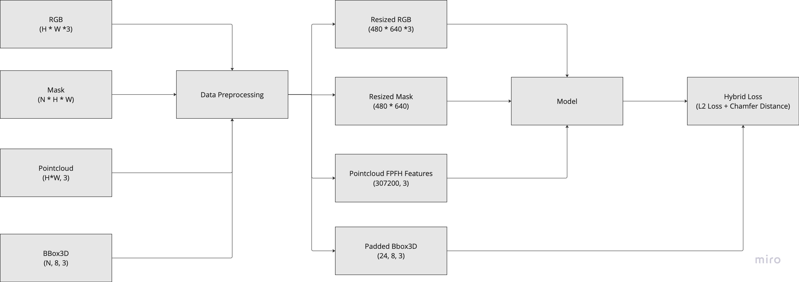
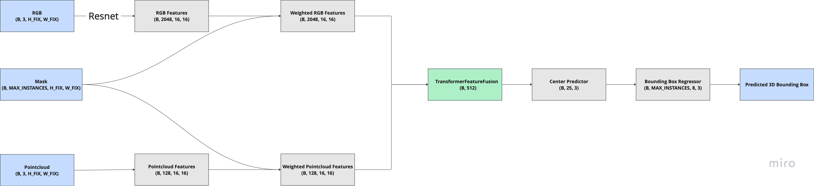

# 3D Bounding Box Prediction - Ashwin MURALI
- A deep learning model for 3D bounding box prediction given RGB, Instance Segmentation Mask, Pointcloud as inputs. 
- The code is a work in progress, intended to demonstrate the overall concept. 
- Due to limited hardware resources and time constraints, some planned features (listed in the TODO) have not yet been implemented. 
- The provided model was only trained for 5 epochs and it has to be atleast trained for 50 epochs to produce reasonable performance.

## Data Preparation
- Resized each image and pointcloud to a fixed dimension.
- Concatenated all instance segmentation masks into one.
- Padded ground truth 3d bounding boxes to equal number of instances.
- Currently, the point cloud features are saved to disk to allow for quick loading during training.

## Model Architecture
- The model integrates RGB and point cloud features into a unified latent representation. 
- Features from both modalities are adaptively weighted using the instance segmentation mask, which serves as an attention mask to focus on relevant regions of the input. 
- From this latent representation, a center predictor generates candidate 3D center points. Subsequently, a bounding box regressor refines these candidate centers to predict the 3D bounding box corners.

## Code
- `requirements.txt` contains the packages used for this codebase.
- `main.py` loads the data from `./data` directory, prepares the data, trains and saves the model.
- `data_viz.py` visualizes a sample from the dataset.
- `test.py` evaluates the model on a test sample that was left out in training.
- `model.pt` is the trained model for 5 epochs and `loss_plot.png` shows the losses over epochs visualization.
- `convert_to_onnx.py` is currently a ToDO.

## ToDo's
- Replace static pointcloud feature extractor with tunable network.
- Replace RGB and pointcloud fusion with Transformer based network.
- Include Data Augmentation to increase the training dataset.
- Debug ONNX model conversion issue.

