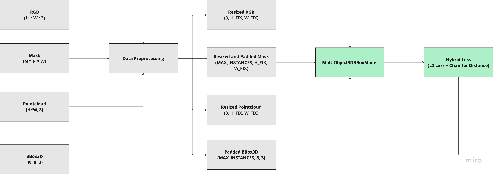

# 3D Bounding Box Prediction - Ashwin Murali
- A framework to train a transformer-based fusion model for 3D bounding box prediction given RGB, Instance Segmentation Mask and Pointcloud as inputs. 
- The framework produces an optimized ONNX model suitable for deployments.

## Getting-Started
- Clone the repository
- Install Dependencies: Run `pip install -r requirements.txt`
- Run unit tests: `pytest -v`
- Train the Model: `python main.py --data_dir <PATH TO DATA DIR> --epochs <EPOCHS> --batch_size <BATCH_SIZE>`
- Infer the Model on a test sample: `python run_inference.py`
- Optimize the Model as ONNX: `python convert_to_onnx.py`

## Implementation Details
|  |
|:--:|
| *Figure 1: System Architecture* |

### Data Preprocessing
To ensure consistency across samples with varying shapes and sizes, the following preprocessing steps were applied:

- **Resizing**: Each image, mask, and point cloud was resized to a FIXED_DIMENSION. FIXED_DIMENSION comprises of a height (H_FIX) and a width (W_FIX).
- **Instance Mask Padding**: Instance segmentation masks were padded to match a fixed maximum number of instances (MAX_INSTANCES).
- **3D Bounding Box Padding**: Ground truth 3D bounding boxes were padded to also match MAX_INSTANCES.
- MAX_INSTANCES is a hyperparameter and set to `25`.
- FIXED_DIMENSION is hyperparameter and set to `640, 640`.
- **Assumption**: The pointcloud is only spatialy interpolated/resized to match FIXED_DIMENSION. Interpolating the point cloud over a new H×W grid does not change the underlying XYZ values. The ground truth bounding boxes remain unchanged. No additional preprocessing is necessary.

### Model Architecture
- The model integrates RGB and point cloud features into a unified latent representation using **Transformers**.
- Features from both modalities are adaptively weighted using the instance segmentation mask before the fusion, which serves as an attention mask to focus on relevant regions of the input. 
- From this latent representation, a center predictor generates candidate 3D center points. Subsequently, a bounding box regressor refines these candidate centers to predict the 3D bounding box corners.
- The model contains **~33.6 million** total params with **~10.1 million** trainable params. The ResNet model used to extract RGB features with its weights is frozen to retain its learnt features.
    - See the model summary containing layer-wise breakdown, total parameter counts, memory estimates and forward pass info [here](model_summary.txt).

|  |
|:--:|
| *Figure 2: Model Architecture* |

### Hybrid 3D Bbox Loss Function
This custom loss function is designed to improve the accuracy of 3D bounding box prediction by combining two complementary terms. L2 loss helps with numerical stability. Chamfer distance improves geometric alignment and is more tolerant to corner ordering issues. Together, they guide the network to learn accurate and perceptually correct 3D box shapes.

- **L2 Loss (Mean Squared Error)**: Measures the direct difference between predicted and ground truth 3D box corner coordinates.
- **Chamfer Distance**: Computes the average closest-point distance between the predicted and ground truth corner sets.

## Sample Results

### RGB Data Augmentation
- Non-geometric data augmentation on RGB images is implemented using the Albumentations library. This augmentation doubles the length of training data. 
- The mask, point cloud, and ground truth bounding boxes are preserved without modification. 
- The augmentations applied include color jittering, Gaussian blur, Gaussian noise, RGB channel shifts, and CLAHE.

|  |
|:--:|
| *Figure 3: RGB Data Augmentation* |

### Model Training and Evaluation
- `AdamW` with a weight decay is used as the optimizer.
- A learning rate scheduler `transformers.get_cosine_schedule_with_warmup` is also used to adjust the learning rate during training to avoid plateaus and overshooting. 
- Training and evaluation logs are saved in [this log](log.txt). 
- Below Figure visualizes the loss over epochs, providing insight into the model's training behavior. The model shows a good learning curve, with the loss decreasing over epochs.

|  |
|:--:|
| *Figure 4: Model Training* |

- The model is evaluated on a held-out test set using a hybrid 3D bounding box loss combining L2 and Chamfer distance. It demonstrates consistent convergence, achieving a test loss of approximately 0.2, indicating reasonable localization accuracy.

## Folder Structure
- `requirements.txt` contains the packages used for this codebase.
- `run_unit_tests.py` runs unit tests to test the framework.
- `data_viz.py` visualizes a sample from the dataset.
- `main.py` loads the data from data directory, prepares the data, trains and saves the model. 
- `convert_to_onnx.py` converts the trained model into deployable low-precision ONNX format.
- `run_inference.py` evaluates the model on a test sample that was left out in training.
- `model.pt` is the trained model, `model.onnx` is the optimized model and `loss_plot.png` shows the losses over epochs visualization.

# Acknowledgments
- [Stack Overflow](https://stackoverflow.com/questions) - Helped resolve aand debug technical issues in the implementation.
- [ChatGPT](https://chatgpt.com/) – Assisted with refining README documentation and docstrings in code.

# Future Work
- Train for longer epochs to better capture learning dynamics and reduce underfitting.
- Further improvements for accurate 3D boxes could include exploring advanced geometric losses, enhanced feature fusion techniques, and richer data augmentation to improve generalization and precision.
